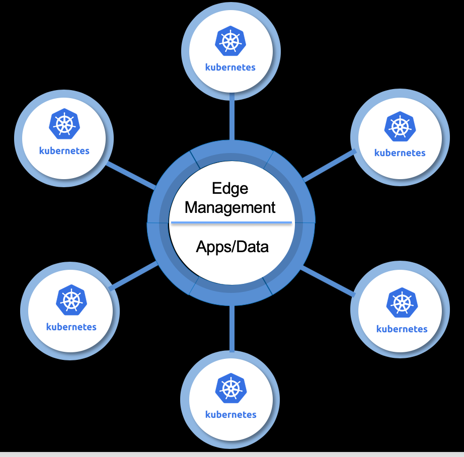

# Edge Infra Services – IEAM and Management Hub

- Deploy and manage critical workloads on edge nodes securely and reliably to hundreds of remote locations 
  from a central location.
- Bring your app to the edge – variety of edge environments supported across market verticals.
- Seamless Integration with OpenShift to deploy containerized apps anywhere.
- Enables large data files such as machine learning model files to have an independent lifecycle from the code that 
  uses it, like an inferencing application.

## Next Step
- [IBM Edge Application Manager (IEAM) 4.2 - Features](ieam42-features.md)