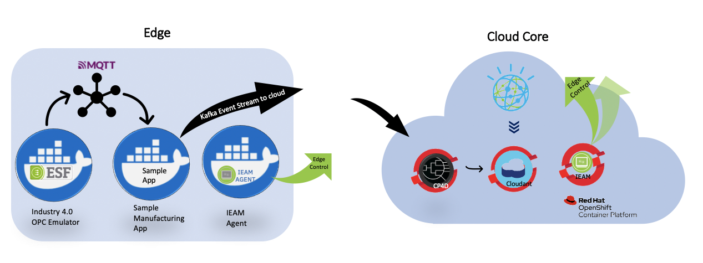

# Edge Workshop Manufacturing Use Case

The diagram in below depicts the edge workshop manufacturing business use case.
- On the Edge side, ESF emulates the application that monitors the factory floor. 
- ESF generates the OPC events and publish it to local MQTT, that is being read by Sample Edge App. 
- Sample Edge App aggregates the events data and send the final output to IBM Event Streams in Cloud Core side.
- On the Cloud Core side, Watson Streams Flows (CP4D) reads this data and save it in IBM CloudantDB database (CP4D) for further analysis.

## Next Step

- [Eurotech IoT Framework](eurotech-iot-framework.md)