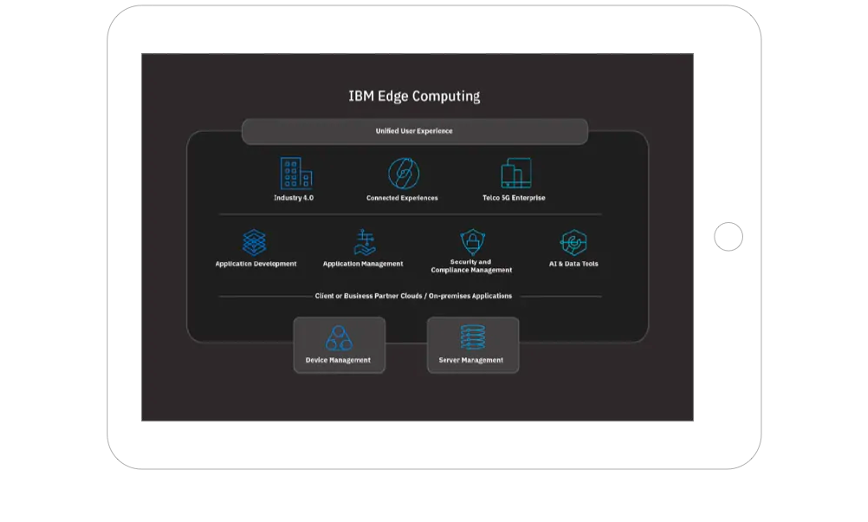

# Edge Overview

## Introduction

- Edge computing is a distributed computing model and open information technology (IT) architecture.
- Edge computing drives applications, data and computing power services away from centralized points and towards places 
  that are closer to the user. This data is processed by a device or by a local computer or server instead of being 
  transmitted to a data center.
- The computation in edge computing is either largely or entirely performed on distributed device nodes. 
  Edge computing focuses on any application that needs to be closer to the source of the action where distributed 
  systems technology interacts with the physical world. Although it may interact with a centralized cloud, 
  edge computing doesn’t need contact with a centralized cloud.
- Edge computing acts on data at the source – usually at the first compute hop.

## Why edge?

- Most common reasons for deploying applications on the edge are related to security 
  (early) and performance (low latency). Highly distributed applications like CDN have long used caching edges 
  for serving content.

## Types of Edges

- Cloud edge
- IoT edge
- Mobile edge

## Considerations for Edge Application Design and Development

- Manage your workloads across all clouds and on any number of devices.

- Deploy applications to all edge locations reliably and seamlessly.

- Maintain openness and flexibility to adopt to evolving needs.

- Operate more securely and with confidence.

## Why IBM Edge?

- Manage the distribution of software at massive scale.

- Leverage open\-source technology.

- Address security concerns.

- Move to autonomous management that's built for scale and variability and runs anywhere.

- Administrators express an intent and autonomous management software Policy executes in line with the intent.

## IBM Edge Application Manager (IEAM)
- IEAM deployed on OpenShift cluster provides the edge computing features to manage and deploy workloads 
  from a management hub cluster to edge devices, cluster and remote instances of OpenShift Container Platform 
  or other Kubernetes-based clusters.

## Next Step
- [IBM Edge Developer Workshop](edge-workshop-developer.md)
  Or,
- [IBM Edge Admin Workshop](edge-workshop-admin.md)