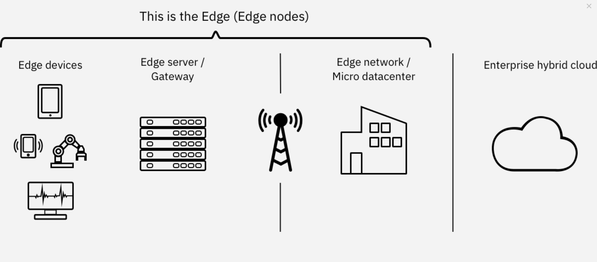

# Edge Computing Regions

The primary regions for edge computing are as follows:

- Edge Devices: The edge and IoT devices are equipped to run analytics, apply AI rules, and even store some data locally to support operations at the
edge. The devices could handle analysis and real-time inferencing without involvement of the edge server or the enterprise region.

- Edge servers: Edge servers are used to deploy apps to the devices. They are in constant communication with the devices by using agents
that are installed on each of the devices. Thousands of edge servers maintain a pulse on the millions of devices. If something more than inferencing 
is needed, data from the devices is sent to the edge server for further analysis.

- Edge network or micro data center: New networking technologies have resulted in the edge network or micro data center, which can be viewed as a
local cloud for devices to communicate with. The edge network reduces the distance that data from the devices must travel and thus decreases latency 
and bandwith issues especially with the advent of 5G. This region also offers more analytical capabilities and more storage for models.

- Enterprise hybrid multicloud: This region offers the classic enterprise-level model storage and management, device management, and especially
enterprise-level analytics and dashboards. This region can be hosted in the cloud or in an on-premises data center.

## Next Step

- [Reference Architecture - IBM Edge Application Manager for Devices](reference-architecture-devices.md)