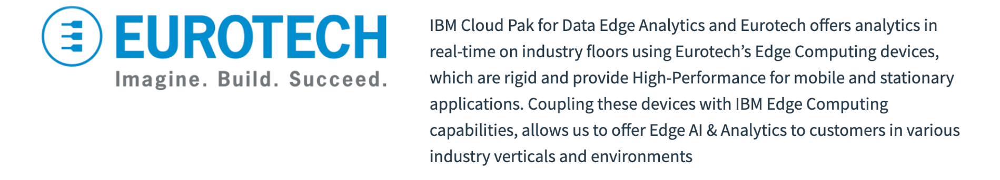
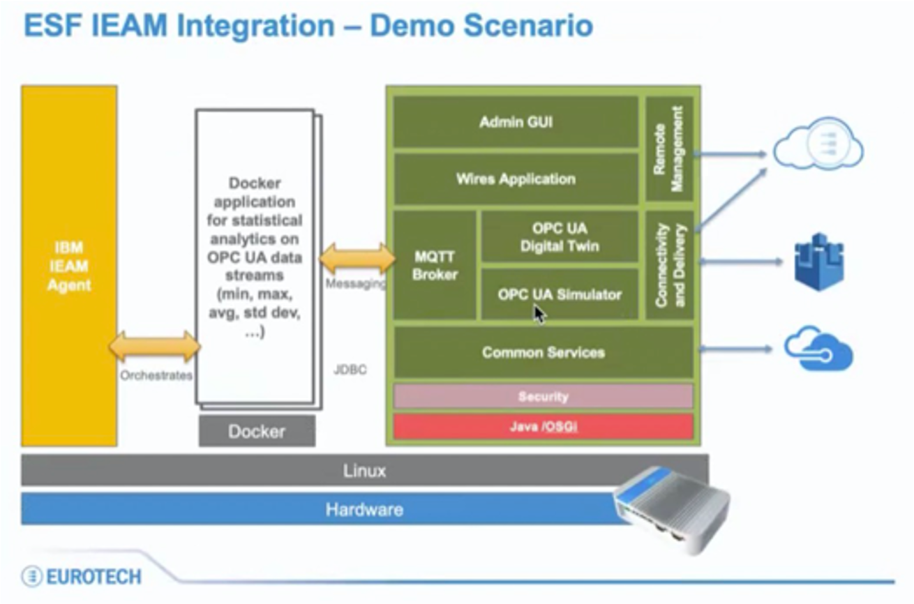

# Eurotech IoT Framework

## EveryWare Software Foundation

[Everyware Software Framework](https://www.eurotech.com/en/products/iot/iot-edge-framework/everyware-software-framework) (ESF) is an enterprise-ready 
IoT Edge Framework distributed and supported by Eurotech. Based on Eclipse Kura, the open-source Java/OSGi middleware for IoT gateways, 
ESF adds provisioning, advanced security, remote access, diagnostics monitoring. It supports ready-to-use field protocols including Modbus, 
OPC-UA, S7, FANUC, J1939, J1979, BACnet, IEC 60870-5-101, IEC 60870-5-104, DNP3, M-bus), MQTT connectivity, and a web-based visual data 
flow programming to acquire data from the field, process it at the edge, and publish it to IoT Cloud Platforms. 
ESF features full remote device management through its integration with Everyware Cloud, Eurotech's IoT Integration Platform.

## EveryWare Software Foundation Dashboard

The figure in below is the ESF dashboard running on edge node that emulates the sensor data on the factory floor of the manufacturing
company. This includes the sensor data such as buzzer, fan, light and temperature and publish it to local MQTT.
The events values are editable in the dashboard with full control to modify the frequency of events generation.

## Next Step

- [Develop & Publish Sample Edge Application](sample-edge-app-publish.md)