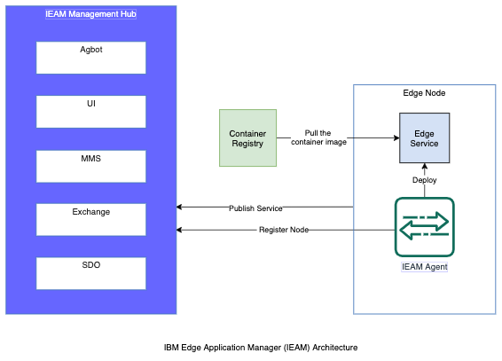

# IBM Edge Application Manager (IEAM) Overview

## Introduction

IEAM Installed on OpenShift cluster provides the edge computing features to manage and deploy workloads 
from a management hub cluster to edge devices, cluster and remote instances of OpenShift Container Platform 
or other Kubernetes-based clusters.

## IEAM Features

- The IEAM management hub is Installed into an OpenShift Container platform and thus it inherits the all the inherent security mechanism 
  benefits.
- All the IEAM management hub network traffic traverses a TLS-secured entry point. Management hub network communication between 
  the IEAM management hub components is performed without TLS.
- The IEAM management hub and distributed agents communicate over the control plane to deploy workloads and models to edge nodes. 
  In contrast to typical centralized Internet of Things (IoT) platforms and cloud-based control systems, the IEAM control plane 
  is mostly decentralized.
- IEAM supports the general concept of multitenancy through organizations, where each tenant has their own organization.
- IEAM supports the Roles Based Access Control (RBAC) through IAM. Following are the typical roles in an organization:
    - Cluster Administrator
    - Administrator
    - Operator
    - Editor
    - Viewer

## Next Step

- [IBM Edge Developer Workshop](edge-workshop-developer.md)
  Or,
- [IBM Edge Admin Workshop](edge-workshop-admin.md)