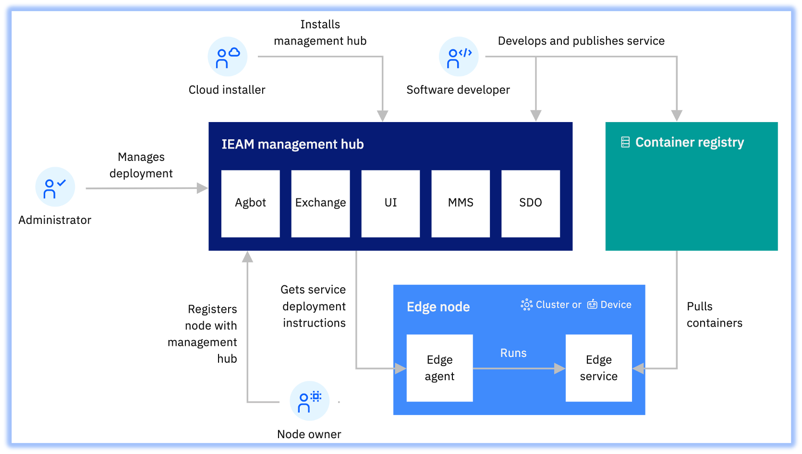

# IBM Edge Application Manager (IEAM) 4.2 – Architecture

## Next Step
- (Optional) [OpenShift Classic Cluster Provisioning - Automated](openshift-automation.md)
- [IBM Edge Application Manager (IEAM) 4.2 Installation - Automated](ieam42-automation.md)
  or,
- [IBM Edge Application Manager (IEAM) 4.2 Installation - Manual](ieam42-installation.md)