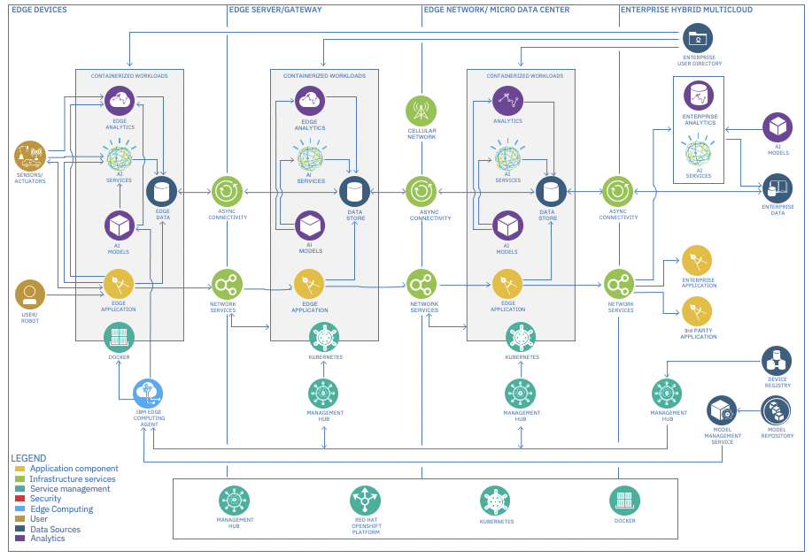

# Reference Architecture - IBM Edge Application Manager for Devices

- Focus is on the outermost edge, the edge devices region.
- This Reference Architecture is most optimal for use cases involving a large Smart Device farm with agents installed 
  on them. These devices communicate with other components to securely orchestrate software lifecycle management. 
  Near real-time inference analysis performed locally.
  
