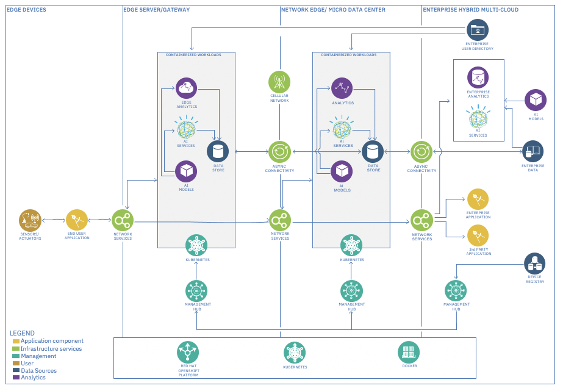

# Reference Architecture - IBM Edge Application Manager for Devices

- Focus is on the outermost edge, the edge devices region.
- This Reference Architecture is most optimal for use cases involving a passive device farm, like IoT Sensors 
  & Actuators. Local inferencing capability not available with dumb devices.

