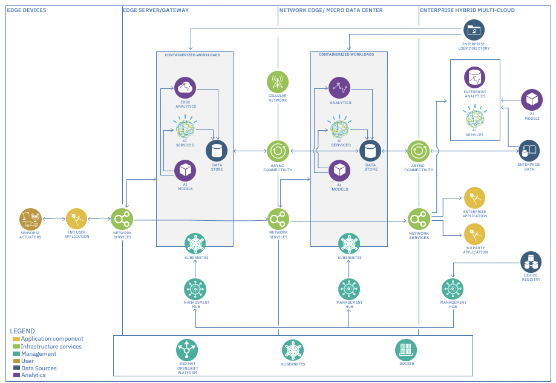

# Reference Architecture - IBM Edge Application Manager for Clusters

- Focus is on edge server tier with higher compute need for edge data processing needed for advanced visualization 
  and AI analytics.
- This Reference Architecture is most optimal for use cases involving processing of large data sets on the edge with 
  results sent back to devices.

